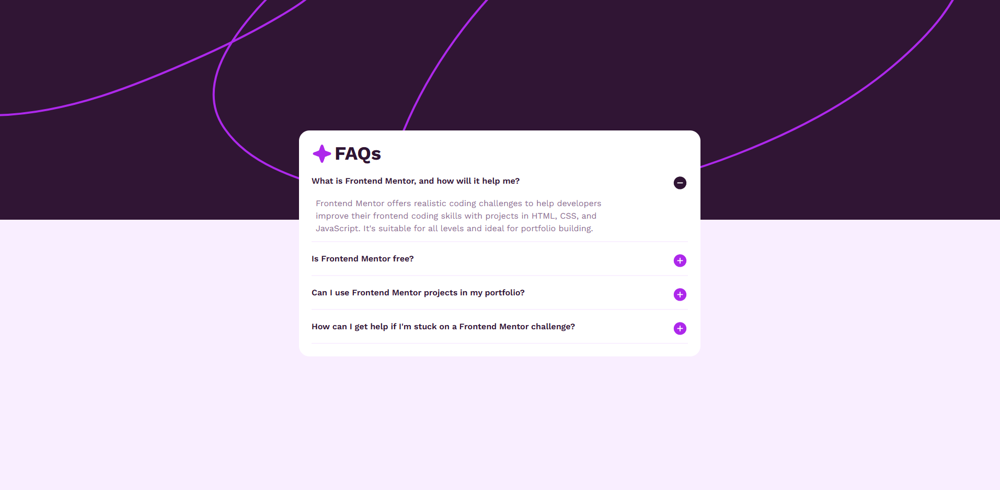

# FAQ accordion

## An interactive accordion component with animated content reveal

This project implements a FAQ accordion component that displays a list of frequently asked questions with expandable answers. Users can click on a question to reveal or hide the corresponding answer, creating a clear and intuitive way to present condensed information.

The component focuses on user interaction, visual feedback, and smooth animations while maintaining a clean and readable layout across different screen sizes.

### Screenshots

#### Image of the Design

### Animation Logic Explanation

The expand and collapse animation is handled through conditional class application based on the active state of each accordion item. when a question is active(clicked), additional height, opacity and spacing are applied to smoothly reveal the answer content.

The animation logic is implemented as follows: 

    ${isActive
      ? 'max-h-70 opacity-100 mt-3'
      : 'max-h-0 opacity-0'
    }

### Built with

- [React](https://react.dev/) - JS library
- [TypeScript](https://www.typescriptlang.org/) - type superset of JS
- [Tailwindcss](https://tailwindcss.com/) - utility-first CSS framework

## Author

- Website - [Mihailo Djurovic](portfolio-miahilo.vercel.app)
